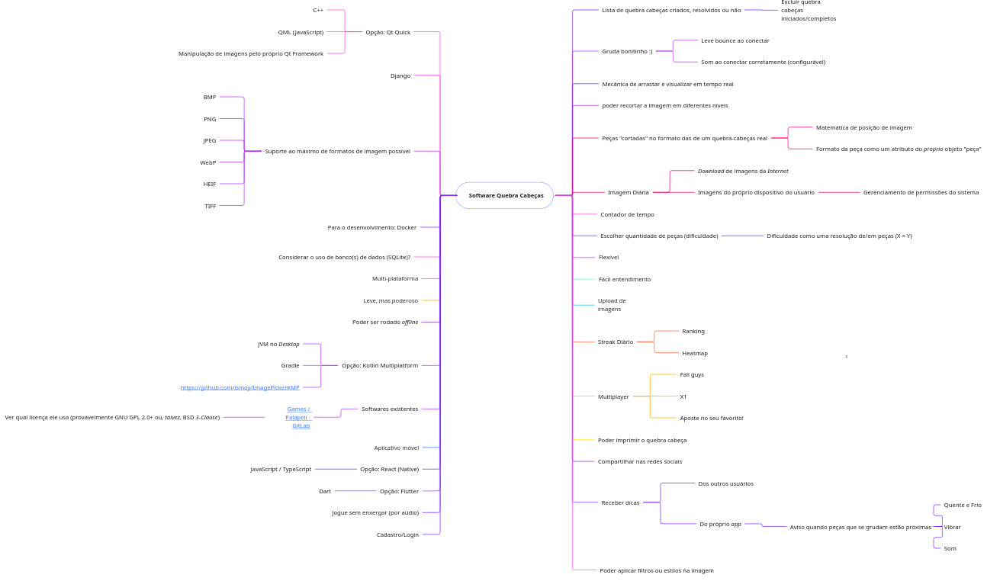
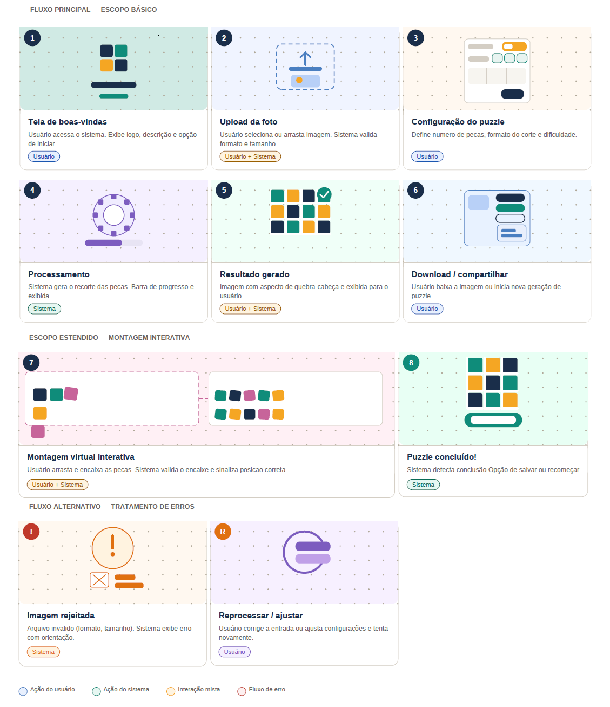
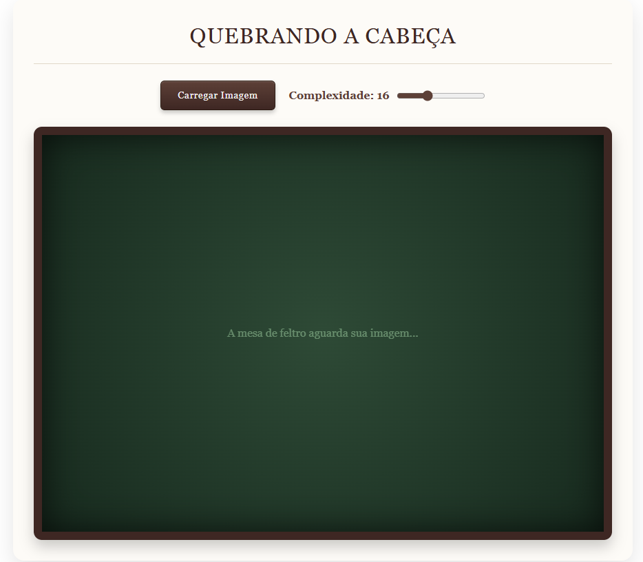
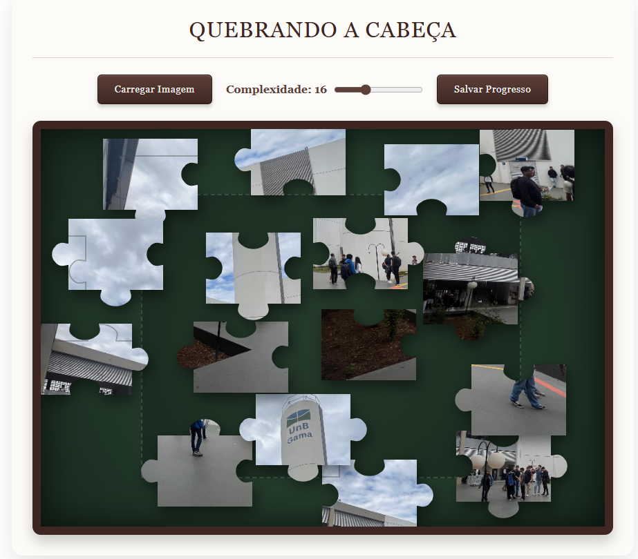
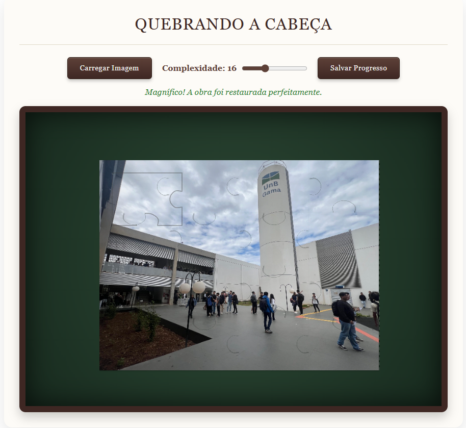
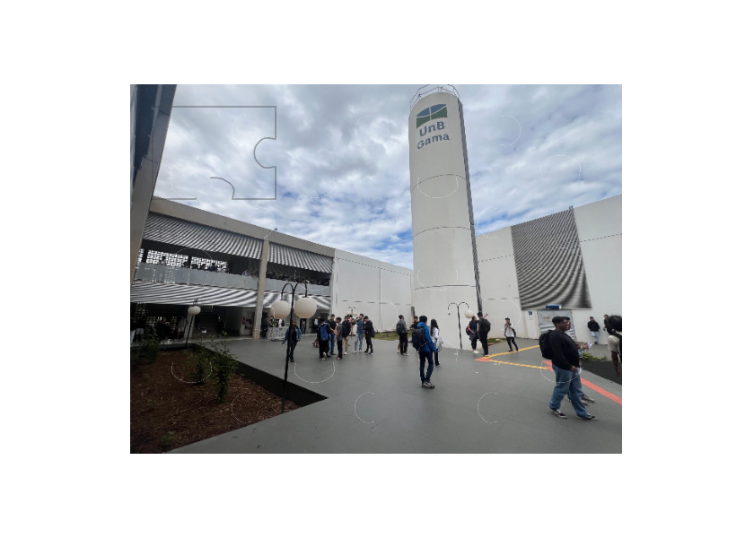

# 1.1. Módulo Design Sprint (Simulada)

<!--Usando a lista de projetos indicados por grupo para o período letivo vigente, realizar Design Sprint para levantamento dos requisitos.

Foco_1: Desing Sprint

Entrega Mínima: Design Sprint, evidenciando cada uma das 5 ETAPAS.
Apresentação (para a professora) explicando passo a passo a Design Sprint realizada, com: (i) rastro claro aos membros participantes (MOSTRAR QUADRO DE PARTICIPAÇÕES & COMMITS); (ii) justificativas & senso crítico sobre o trabalho realizado, e (iii) comentários gerais sobre o trabalho em equipe. Tempo da Apresentação: +/- 5min. Recomendação: Apresentar diretamente via Wiki ou GitPages do Projeto. Baixar os conteúdos com antecedência, evitando problemas de internet no momento de exposição nas Dinâmicas de Avaliação.

A Wiki ou GitPages do Projeto deve conter um tópico dedicado ao Módulo Design Sprint, com as etapas da Design Sprint documentadas, histórico de versões, referências, e demais detalhamentos gerados pela equipe nesse escopo.
Demais orientações disponíveis nas Diretrizes (vide Aprender3).-->

Esta seção documenta a execução da [Design Sprint](https://www.gv.com/sprint/) adaptada, realizada em dinâmica de sala de aula e reuniões com duração reduzida para levantamento de requisitos e definição do escopo do projeto **Quebrando a Cabeça**.

## 1. Metodologia
A metodologia foi condensada em 4 etapas de 30 minutos cada e a etapa de Testing, focando na agilidade e convergência de ideias:

* **Parte 1 - Unpack (30min):** Brainstorming coletivo para levantamento do escopo.
    * **Artefato Gerado:** Mapas Mentais.
* **Parte 2 - Sketch (30min):** Expressão individual das ideias debatidas.
    * **Artefato Gerado:** Rich Pictures individuais.
* **Parte 3 - Decision (30min):** Escolha da proposta mais aderente e definição do fluxo.
    * **Artefato Gerado:** Storyboarding.
* **Parte 4 - Prototype (30min):** Construção da interface visual.
    * **Artefato Gerado:** Protótipo Figma (Alta fidelidade).
* **Parte 5 - Testing:** Validação do protótipo com público-alvo/cliente.

## 2. Unpack
Realizamos uma reunião para fazer um brainstorming, no qual discutimos várias idéias de funcionalidades
e escopo do nosso projeto. Documentamos o processo com um mapa mental que fizemos colaborativamente pelo Miro:

<iframe width="768" height="432" src="https://miro.com/app/live-embed/uXjVGq8hFn8=/?embedMode=view_only_without_ui&moveToViewport=458,-604,3675,1876&embedId=533475170538" frameborder="0" scrolling="no" allow="fullscreen; clipboard-read; clipboard-write" allowfullscreen></iframe>

**Captura de tela da versão 1:**

Foi um dos pontos altos da dinâmica de Design Sprint. O formato de brainstorming permitiu liberdade total, resultando em um mapa mental rico em funcionalidades e sem restrições técnicas imediatas, boa comunicação.

## 3. Sketch
Cada integrante desenhou um rich picture individualmente em sala de aula.

| **Lucas Machado Peres Ricarte** | **Carlos Henrique Brasil de Souza** | **Caio Rocha de Oliveira** |
| :---: | :---: | :---: |
|  |  |  |
| **Fábio Alessandro Torres Santos** | **João Eduardo Pereira Rabelo** | **João Felipe Oliveira Alves e Silva** |
|  |  |  |
| **Marcos Vinícius Gündel da Silva** | **Pedro Teixeira Moriel Sanchez** | **Eduardo de Almeida Morais** |
|  |  |  |
| | **Yogi Nam de Souza Barbosa** | |
| |  | |

Percebemos que houve uma estagnação criativa. A equipe demonstrou dependência do que colocamos no mapa mental, então não tivemos inovações nos Rich Pictures. Embora tenha faltado inovação nesta fase, achamos que os Rich Pictures foram eficazes para rascunhar o fluxo de usuário e a hierarquia visual.

## 4. Decision
A partir dos rich pictures individuais fizemos uma [votação assíncrona](https://pollunit.com/polls/u4mqzdz8qhd6_klahr546q), no qual cada integrante votou nos preferidos, a partir do rich picture escolhido foi realizado o desenho de uma storyboarding para guiar o desenvolvimento do protótipo.

Rich picture escolhido:

Storyboarding:

## 5. Prototype
A partir do storyboarding fizemos um protótipo de alta fidelidade no Figma:

<iframe style="border: 1px solid rgba(0, 0, 0, 0.1);" width="800" height="450" src="https://embed.figma.com/site/alGvzuUtKPYlK9cfEDlgaT/Untitled?node-id=0-3&embed-host=share" allowfullscreen></iframe>

Para testar o protótipo no figma clique no nome "Protótipo" perto do símbolo do Figma para ser redirecionado ao site do Figma. Lá, você conseguirá testar o protótipo apertando no botão com o símbolo de "Play" no canto superior direito.

### 5.1. Tela Inicial

- Nessa tela, acontecem 3 ações do Storyboard: "1. Tela de boas-vindas", "2. Upload da foto" e "3. Configuração do Puzzle". 
- A dificuldade foi definida como a quantidade de peças que é um quadrado, ou seja, 4 peças vão representar um quadrado 2x2 e assim por diante.
- O protótipo suporta upload de fotos. 
- O protótipo suporta a opção das seguintes dificuldades com formatos determinísticos: 4, 9, 16, 25, 36, 49 e 64 peças. 
- O protótipo suporta os seguintes formatos: "BMP", "PNG", "JPEG", "WebP", "HEIF". 
- As posições são aleatórias (embaralhamento). 

### 5.2. Montagem do Quebra-Cabeça

- Nessa tela, acontecem 4 ações do Storyboard: "4. Processamento,5. Resultado gerado", "6. Download / compartilhar" e "7. Montagem virtual interativa".
- Ao clicar no botão "Salvar Progresso" o usuário consegue baixar o quebra-cabeça com as peças nas suas posições atuais no formato png. Ele pode compartilhar ou recomeçar o quebra-cabeça usando a imagem como referência em outro momento.
- O usuário consegue arrastar e mover as peças para as posições corretas, onde a peça será fixada e não poderá mais ser movida.    

### 5.3. Conclusão

- Nessa tela, acontece 1 ação do Storyboard: "8. Puzzle concluído!".
- Ao clicar no botão "Salvar Progresso" o usuário poderá salvar o quebra-cabeça montado.
- Para recomeçar, basta fazer o upload da mesma imagem ou iniciar um novo quebra-cabeça com uma nova imagem. 
- Exemplo de quebra-cabeça resolvido:

## 6. Testing
A partir do protótipo cada integrante realizou revisou e testou a usabilidade do protótipo, visto que somos parte do público-alvo.

## 7. Rastreabilidade & Elos com Outros Artefatos
* **Entrada:** Descrição do Projeto G6.
* **Saída:** Backlog Inicial e Requisitos Não-Funcionais de interface.
* **Conexões:** Os Mapas Mentais guiaram os Rich Pictures, que por sua vez fundamentaram o Storyboard utilizado como guia direto para o Protótipo no Figma.

Foi um bom processo para definição de um Produto Mínimo Viável (MVP), mas evidenciou a dificuldade do grupo em mostrar novas ideias após o fechamento do primeiro mapa mental. Além disso foram gerados artefatos que são benéficos para o desenvolvimento do projeto.

## 9. Referências

* GOOGLE VENTURES. **The Design Sprint**. Disponível em: https://www.gv.com/sprint/. Acesso em: 28 mar. 2026.
* SERRANO, Milene. **Material de Apoio: Design Sprint Adaptada**. FCTE/UnB, 2026.

## 10. Participações

> As participações estão na página [1.4. Participações - Base](/Base/1.4.ParticipacoesBase?id=módulo-design-sprint-foco-1)