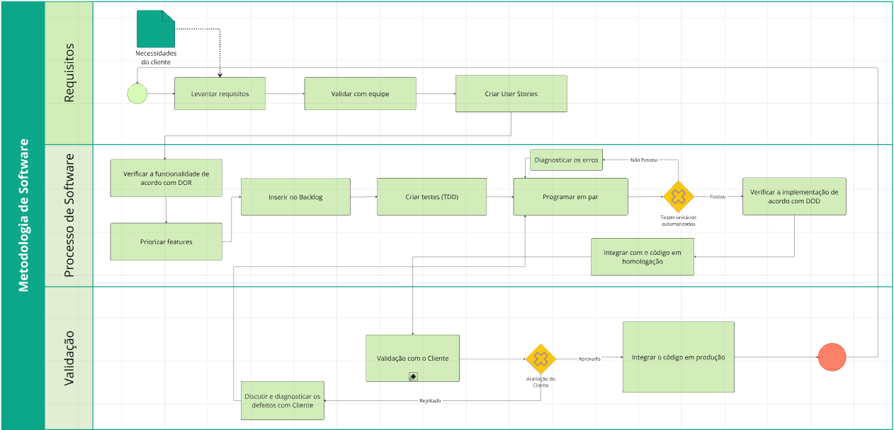
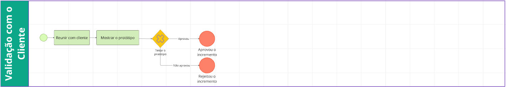

# 1.3. Módulo Modelagem BPMN

<!--Foco_3: Modelagem na Notação BPMN.

Entrega Mínima: Modelagem BPMN, orientando-se por uma abordagem metodológica à escolha da equipe (por exemplo, combinação de práticas do Scrum & XP).

Apresentação (para a professora) explicando o detalhamento metodológico desenhado como um modelo em BPMN, com: (i) rastro claro aos membros participantes (MOSTRAR QUADRO DE PARTICIPAÇÕES & COMMITS); (ii) justificativas & senso crítico sobre as escolhas metodológicas adotadas para o projeto; e (iii) comentários gerais sobre o trabalho em equipe. Tempo da Apresentação: +/- 5min. Recomendação: Apresentar diretamente via Wiki ou GitPages do Projeto. Baixar os conteúdos com antecedência, evitando problemas de internet no momento de exposição nas Dinâmicas de Avaliação.

A Wiki ou GitPages do Projeto deve conter um tópico dedicado ao Módulo Modelagem BPMN, com modelagem BPMN (viés metodológico), histórico de versões, referências, e demais detalhamentos gerados pela equipe nesse escopo.
Demais orientações disponíveis nas Diretrizes (vide Aprender3).-->

## 1. Metodologia de Software

Foi criado um diagrama *Business Process Model and Notation* (*BPMN*) na plataforma *Miro*. Esse diagrama representa o passo-a-passo dos desenvolvedores do aplicativo no processo de desenvolvimento de software. A metodologia escolhida foi o *Extreme Programming*, *XP*. A principal justificativa foi a experiência da equipe em outros projetos que utilizaram o *XP* como metodologia de software, mas ainda houve outros motivos como: preferência por expressar requisitos em forma de história de usuário, fazer pequenas entregas frequentes, foco em testes desde o começo do desenvolvimento, programação em pares e outros motivos discutidos nas reuniões. 

**Miro:**

<iframe width="768" height="432" src="https://miro.com/app/live-embed/uXjVGnju0LM=/?embedMode=view_only_without_ui&moveToViewport=1484,-4182,13933,6712&embedId=432334837910" frameborder="0" scrolling="no" allow="fullscreen; clipboard-read; clipboard-write" allowfullscreen></iframe> 

**Captura de tela da versão 1:**

### 1.1. Validação com o Cliente

**Captura de tela da versão 1:**

## 2. DoR 								              
**O Requisito está representado por uma história de usuário?** 
A demanda deve estar formalizada no formato de user story (ex: "Como \[perfil\], eu quero \[ação\], para que \[valor\]"), garantindo o foco no valor para o usuário.

**O Requisito cabe em uma iteração?**  
O requisito deve ter um tamanho que permita sua conclusão dentro de uma única iteração.

**O Requisito está mapeado para uma interface (Quando necessário)?**  
Caso o requisito demande uma interface, ele precisa ter sua representação visual definida (protótipo) para melhor clareza no desenvolvimento.  
								
**O Requisito possui informação necessária para ser trabalhado?**  
É fundamental que o requisito apresenta informações claras e detalhadas, garantindo que a equipe de desenvolvimento possa iniciar o trabalho sem interpretações erradas.

**O Requisito é redundante?**  
Não deve haver outro requisito que implemente uma funcionalidade parecida/idêntica similar.

**O Requisito está coberto por Critérios de Aceitação (quando necessário)?**  
O requisito deve conter critérios de aceitação claros e específicos antes de entrar em desenvolvimento.

**O Requisito cabe dentro das prioridades atuais do projeto?**  
O requisito deve ser realizado se estiver dentro da categoria de prioridade atualmente trabalhada na iteração do projeto (ex. por MoSCoW), senão ele pode ser adiado até sua prioridade, eventualmente, passar a se alinhar com a de uma futura iteração.

## 3. DoD
**Revisão de código (peer review) concluída e aprovada?**
O Pull Request no GitHub foi revisado e aprovado por, no mínimo, um outro membro da equipe de desenvolvimento. Todos os comentários e ajustes solicitados na revisão foram resolvidos.

**O backend foi integrado ao frontend?**
Backend e frontend devem ser integrados corretamente.

**A funcionalidade está responsiva?**  
A funcionalidade deve estar responsiva, adaptando-se corretamente a dispositivos móveis (largura mínima de 320px), tablets, e desktops (até 1920px), mantendo a usabilidade e legibilidade em todas as resoluções.

**Está documentado?** 
A documentação técnica e funcional está atualizada e disponível, facilitando o uso, manutenção e continuidade do desenvolvimento.

**Atende aos critérios de aceitação?** 
Todos os critérios de aceitação definidos previamente foram cumpridos, garantindo o comportamento esperado.

**Testes unitários e de integração aprovados?** 
Todos os testes unitários e de integração foram executados e aprovados, garantindo que o sistema funcione corretamente e de forma integrada.

## 4. Referências

* MATOS, Rafael Lopes de. Especificação do Processo de Desenvolvimento de Software Embarcado Utilizando o BPMN. 2013. 91p. Monografia - Programação de Educação Continuada em Engenharia, Escola Politécnica da Universidade de São Paulo, São Paulo, 2013.
* PRESSMAN, Roger S. Engenharia de Software: uma abordagem profissional. 7. ed. Porto Alegre, 2011.
* AGILE ALLIANCE. Definition of Done. Agile Alliance Glossary, [s.d.]. Disponível em: https://www.agilealliance.org/glossary/definition-of-done/. Acesso em: 5 abr. 2026.

## 5. Participações

> As participações estão na página [1.4. Participações - Base](/Base/1.4.ParticipacoesBase?id=módulo-modelagem-bpmn-foco-3)