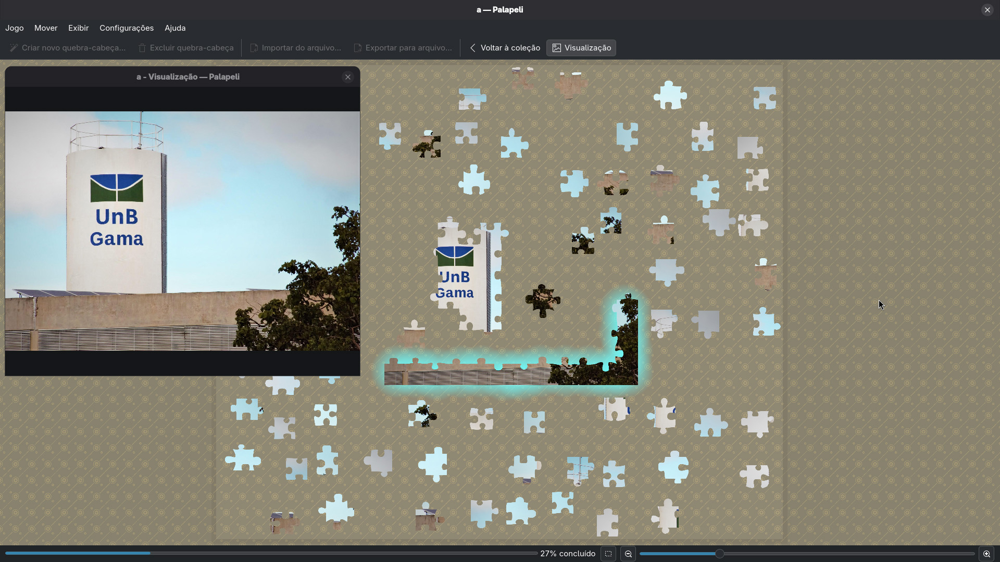
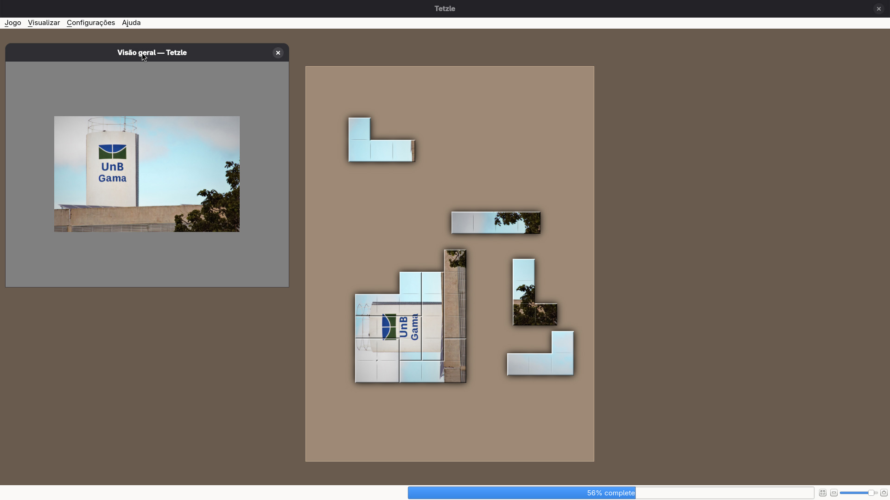
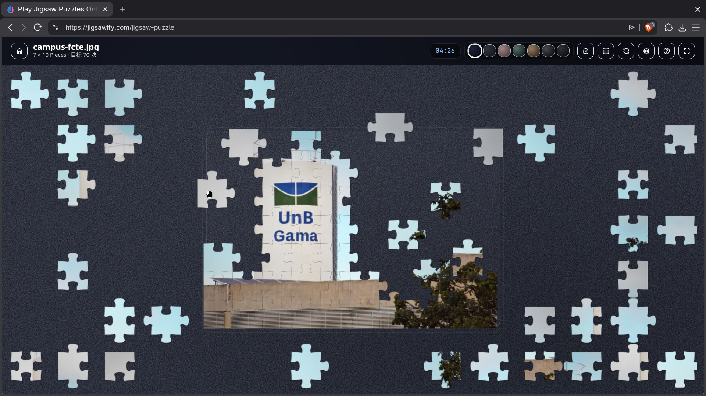
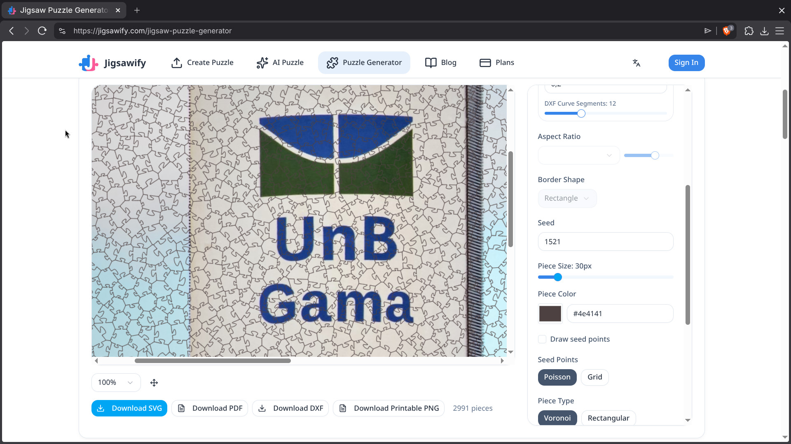

# 1.5. Iniciativas Extras (Base)

<!--Breve relato sobre as Iniciativas Extras realizadas pela equipe, no escopo da entrega.

Apresentar links para comprobatórios que evidenciem qualquer que seja a realização extra conferida pela equipe no escopo da entrega.-->

## Análise de softwares existentes

### Palapeli

**Descrição:** O [Palapeli](https://apps.kde.org/pt-br/palapeli/) é um jogo de quebra-cabeça para um único jogador. Diferente de outros jogos do gênero, você não está limitado a alinhar as peças em grades imaginárias. As peças são movidas livremente. Além disto, o Palapeli possui persistência real, por exemplo, tudo o que você faz é salvo no disco imediatamente.

### 🧩 Ficha de Análise
| Atributo | Detalhes Técnicos |
| :--- | :--- |
| **Desenvolvedor** | Comunidade KDE |
| **Licença** | GNU GPL v2+ (Open Source) |
| **Plataformas** | Linux (Nativo, Snap, Flatpak), FreeBSD, suporte experimental p/ macOS |
| **Formatos** | Importa qualquer formato de imagem comum (JPG, PNG, WebP) |
| **Linguagem de Programação** | C++ |

### 🛠️ Funcionalidades
* **Persistência de Estado:** Salva o progresso automaticamente ao fechar o aplicativo, permitindo retomar jogos.
* **Customização de Imagem:** Permite transformar qualquer foto do usuário em um quebra-cabeça.
* **Slicers (Cortadores):** Permite escolher diferentes algoritmos de corte (peças retangulares simples, com plugues clássicos ou formatos irregulares).
* **Gerenciamento de Espaço:** Inclui "porta-peças" (containers) para organizar peças em quebra-cabeças complexos sem poluir a tela.
* **Backup de Jogos:** Permite importar e exportar jogos, para salvar o estado e transferir/compartilhar jogos.

### Tetzle

**Descrição:** O [Tetzle](https://gottcode.org/tetzle/) é um jogo de quebra-cabeça que utiliza peças em formatos de tetrominós (estilo Tetris) para compor o jogo.

### 🧩 Ficha de Análise
| Atributo | Detalhes Técnicos |
| :--- | :--- |
| **Desenvolvedor** | Graeme Gott |
| **Licença** | GNU GPL v3+ (Open Source) |
| **Plataformas** | Linux, Windows, macOS |
| **Formatos** | Importa imagens comuns (JPG, PNG, BMP, WebP) |
| **Linguagem de Programação** | C++ |

### 🛠️ Funcionalidades Interessantes
* **Persistência de Estado:** Salva o progresso automaticamente ao fechar o aplicativo, permitindo retomar jogos.
* **Customização de Imagem:** Permite transformar qualquer foto do usuário em um quebra-cabeça.
* **Peças em Tetrominós:** Todas as peças do quebra-cabeça possuem formatos baseados no jogo Tetris e elas devem ser rotacionadas para encaixar.

> Nota: Crashou uma vez quando estávamos testando, então não é muito estável.

### Jigsawify

**Descrição:** O [Jigsawify](https://jigsawify.com/) é uma plataforma web focada na criação e montagem de quebra-cabeças digitais diretamente no navegador. O diferencial desta ferramenta é a integração com Inteligência Artificial para geração de imagens via prompts de texto e a capacidade de exportar arquivos vetoriais para a fabricação de quebra-cabeças físicos.

### 🧩 Ficha de Análise

| Atributo | Detalhes Técnicos |
| :--- | :--- |
| **Desenvolvedor** | Madhukar Moogala |
| **Licença** | - |
| **Plataformas** | Web (Multiplataforma via Navegador) |
| **Formatos** | Importa JPG, PNG, WebP; Exporta SVG, PDF, DXF, PNG |
| **Linguagem de Programação** | JavaScript, C# |

### 🛠️ Funcionalidades

* **Customização de Imagem:** Permite transformar qualquer foto do usuário em um quebra-cabeça.
* **Gerador de Imagem por IA:** Integração com modelos de texto para imagem (text-to-image) para criar artes personalizadas para os puzzles.
* **Exportação para Makers:** Gera arquivos em SVG e DXF compatíveis com máquinas de corte a laser e CNC para produção física.
* **Guia Visual (Ghost Image):** Oferece um modo de visualização transparente da imagem original no fundo da tela de jogo para auxiliar na montagem.
* **Compartilhamento por Link:** Gera links únicos para que outros usuários possam jogar o mesmo quebra-cabeça e comparar tempos de conclusão.

> Nota: Funcionalidades avançadas e gerações por IA dependem de um sistema de créditos ou assinatura paga, limitando o uso gratuito extensivo.

> Nota: Experiência de jogo é meio ruim, tem bugs ao arrastar peças compostas perto de peças pequenas.

### Jigsaw HD

**Descrição:** O [Jigsaw HD](https://play.google.com/store/apps/details?id=com.veraxen.jigsaw) é um aplicativo mobile de quebra-cabeças. Ele oferece uma vasta biblioteca de imagens e permite que o usuário utilize suas imagens também.

### 🧩 Ficha de Análise

| Atributo | Detalhes Técnicos |
| :--- | :--- |
| **Desenvolvedor** | Veraxen Ltd. |
| **Licença** | - |
| **Plataformas** | Android, iOS |
| **Formatos** | Galeria interna proprietária; importa fotos do dispositivo (JPG, PNG) |
| **Linguagem de Programação** | - |

### 🛠️ Funcionalidades

* **Customização de Imagem:** Permite transformar qualquer foto do usuário em um quebra-cabeça.
* **Dificuldade Configurável:** Permite ativar ou desativar o modo de rotação de peças.
* **Sistema de Dicas e Ajuda:** Oferece pré-visualização da imagem completa, sistema de dicas (por anúncios), e filtrar peças de bordas.
* **Progressão e Recompensas:** Desafios diários que concedem moedas virtuais para desbloquear pacotes de imagens premium e coleções exclusivas.
* **Modo Offline:** Permite baixar pacotes de imagens para jogar sem conexão com a internet, mantendo a persistência do estado do jogo localmente.

> Nota: O aplicativo exibe anúncios entre as partidas na versão gratuita, o que prejudica a fluidez da experiência.