# 1.2.3. Glossários

## Introdução

Este glossário lista termos/palavras-chave dos domínios do conhecimento que venham ser relevantes ao aplicativo em projeto – especialmente o próprio domínio dos quebra-cabeças – com a sua definição e em ordem alfabética, visando facilitar a manutenção do sistema sendo desenvolvido neste projeto e de outros documentos de requisitos seus. Este documento pode ir sendo atualizado e ajustado iterativa e/ou continuamente tanto conforme as análises de requisitos do projeto como junto com outros processos dele.

## Glossário 1: Nomes Miscelâneos na Língua Inglesa

| Palavra-chave | Tipo | Significado(s) | Ilustração |
| ------------- | ---- | -------------- | ---------- |
| *Jigsaw*      | Substantivo | Serra tico-tico/de recortes/de vaivém: um tipo de ferramenta elétrica que, efetuando movimentos de vaivém com pequenas serras, proporciona ao utilizador condições de realizar cortes detalhados e em curva. Originalmente, os quebra-cabeças eram cortados com ela, daí o seu nome coloquial na língua inglesa descrito a seguir. | 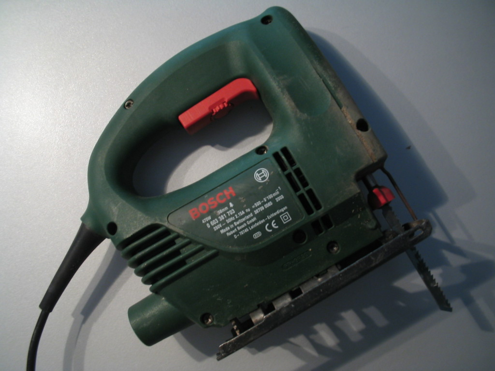 |
| *Jigsaw puzzle* | Substantivo | Quebra-cabeça: um tipo de enigma em que o objetivo é reconstruir uma imagem que foi cortada/seccionada em várias pequenas peças, costumeiramente intertravadas. |  |
| *Piece*       | Substantivo | Peça; a seção individual/unitária de um quebra-cabeça. |  |
| *Bit*         | Substantivo | Sinônimo de/para uma peça (*piece*) de quebra-cabeça. |  |
| *Clutch power*/*Tight fit* | Substantivo | Ato de pegar uma seção de (aproximadamente) 10-15 peças sem elas se soltarem no processo. | 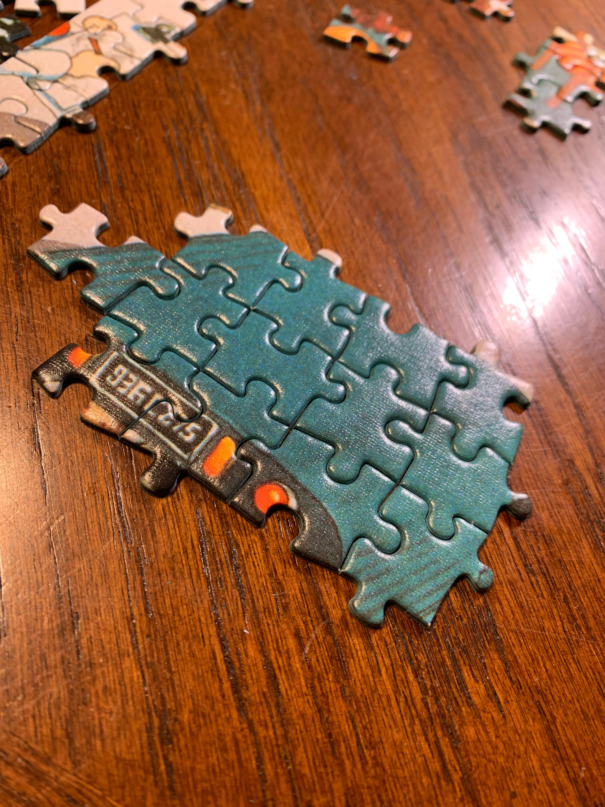 |
| *False fit*   | Substantivo | Quando peças cabem ou parecem caber em certas áreas, mas na realidade não são para serem colocadas nessas posições. Termos equivalentes na língua portuguesa, então, incluiriam "falso positivo", "peça desajustada" etc. | 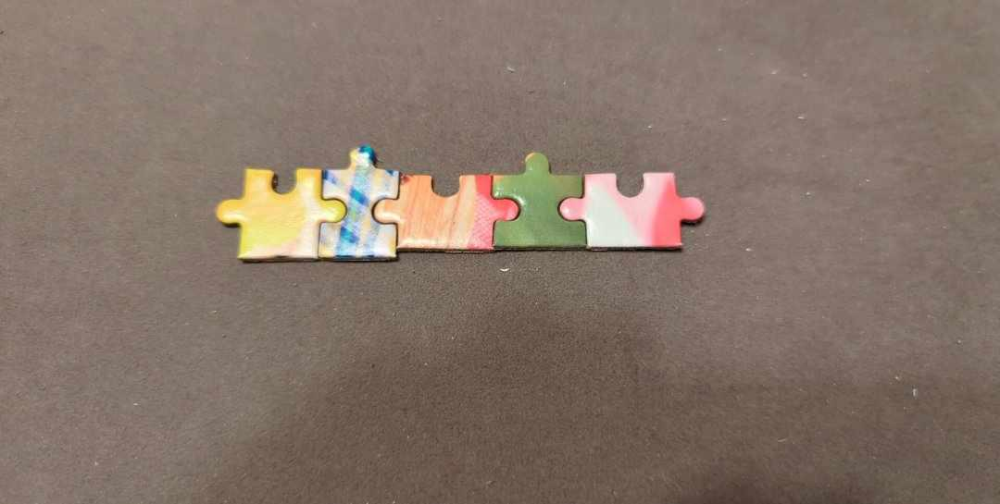 |
| *Snack puzzle*/*Snack puzz* | Substantivo | Um quebra-cabeça de menor número de peças ou imagem mais "fácil" que pode ser resolvido num período de tempo mais curto – como um "lanche", ou "*snack*" em inglês, daí o nome –. | 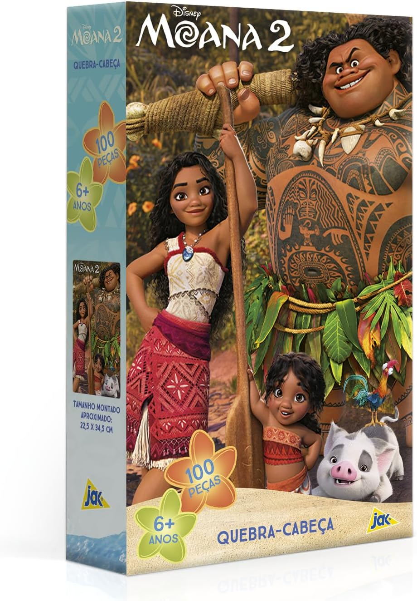 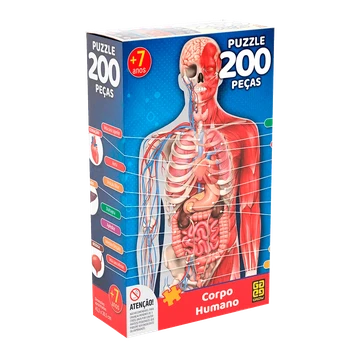 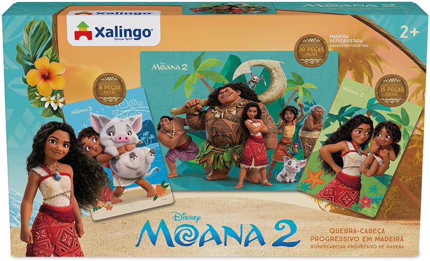

## Glossário 3: Anatomia da Peça

| Palavra-chave | Contraparte(s) na língua inglesa | Tipo | Significado(s) |
| ------------- | -------------------------------- | ---- | -------------- |
| Borda         | *Edge*                           | Substantivo | Peça com pelo menos um lado reto, usada para formar o limite externo do quebra-cabeça (assumindo o uso de formato padrão retangular ou quadrado). |
| Canto         | *Corner*                         | Substantivo | Peça com exatamente dois lados retos. Como o seu próprio nome sugere, tal peça é empregada para cada canto diagonal do limite do quebra-cabeça. |
| Cavidades     | *Blanks*; *sockets*              | Substantivo | Os espaços vazios ou buracos onde as saliências se encaixam. Na área técnica, também chamados de *Augen*.. Coloquialmente, podem ser apelidadas em inglês de "*innies*". |
| Peça figurativa | *Whimsie*                      | Substantivo | Peça cortada em formatos reconhecíveis (como animais, flores ou objetos). É uma marca registrada de quebra-cabeças de madeira clássicos e de luxo. |
| Salências     | *Tabs*; *knobs*                  | Substantivo | As extensões que se projetam para fora da peça, popularmente chamadas de "pinos" ou "cabeças". Na fabricação, também são referidas pelo termo técnico alemão *Zapfen*. Coloquialmente, podem ser apelidadas em inglês de "*outies*". |

## Glossário 4: Tipos de Corte e Fabricação

| Palavra-chave | Contraparte(s) na língua inglesa | Tipo | Significado(s) | Ilustração |
| ------------- | -------------------------------- | ---- | -------------- | ---------- |
| Canto dividido | *Split corner* | Substantivo | Um canto "dividido" em várias peças, que não parecem formar um canto à primeira vista. |  |
| Canto falso   | *Phony corner* | Substantivo | Uma peça especial com a forma de um canto, mas que não o é de verdade. |  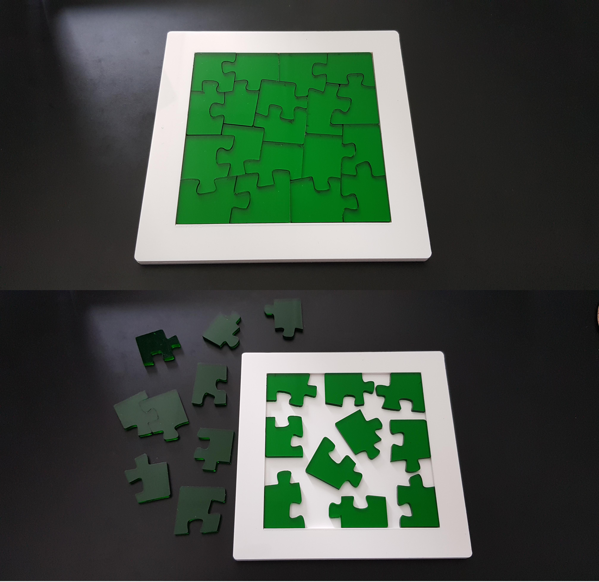 |
| Corte aleatório | *Random cut*                   | Substantivo | Padrão de corte assimétrico. As peças possuem formatos variados, irregulares e imprevisíveis. | 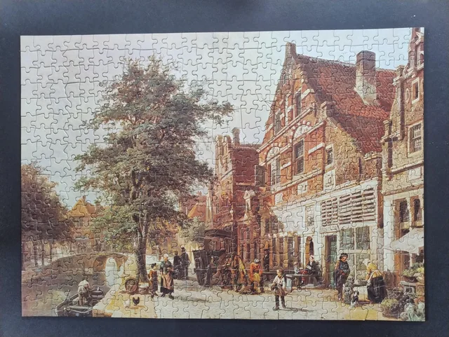
| Corte de contorno | *Contour cut* | Substantivo | Peças cortadas seguindo os contornos de um objeto na imagem. [Os primeiros quebra-cabeças usavam um corte de contorno para dissecar mapas, ajudando crianças a aprender(em) geografia.] |  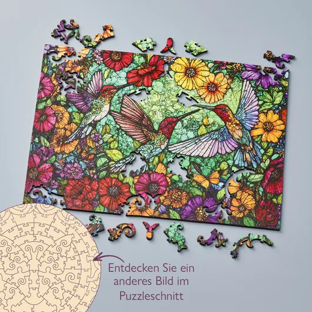 
| Corte em fita | *Ribbon cut*                     | Substantivo | Padrão de corte em grade. As peças têm tamanhos semelhantes e cantos que se alinham formando linhas contínuas. | 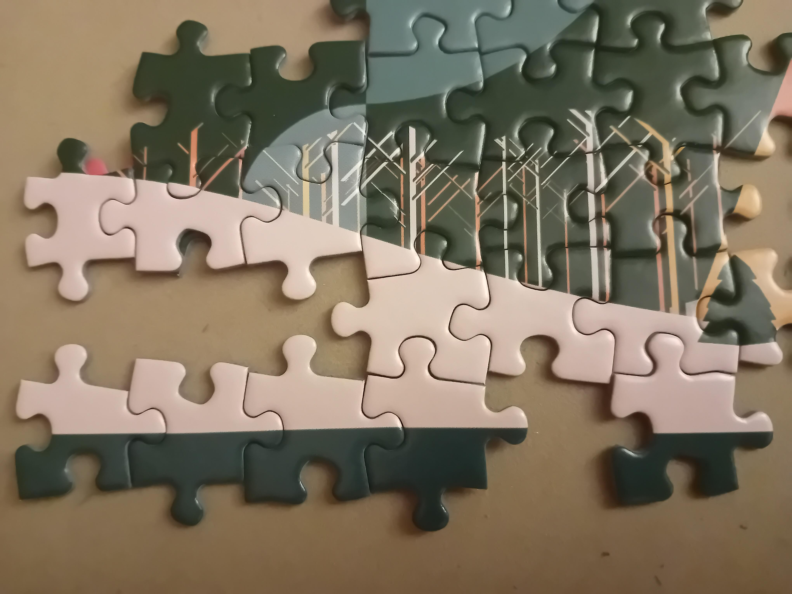
| Corte em matriz | *Die cut*                      | Substantivo | O método industrial padrão desde a década de 1930, que utiliza lâminas de metal afiadas prensadas sobre o papelão ou a madeira para cortar o padrão inteiro de uma só vez. | 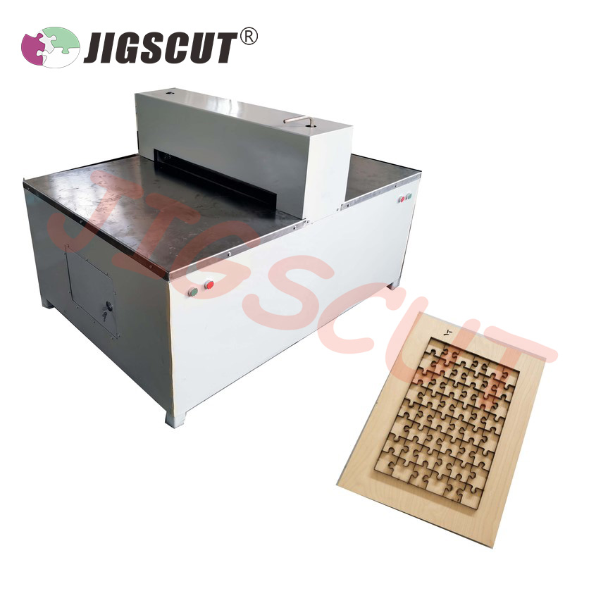 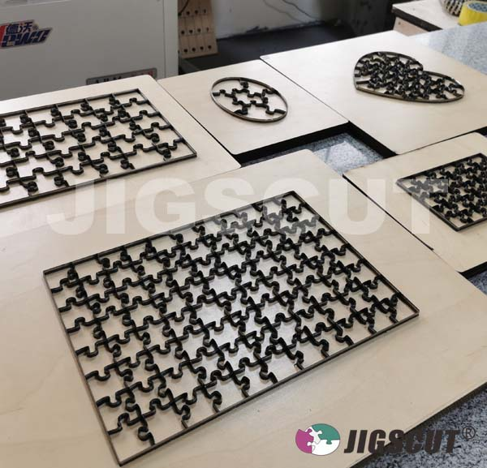
| Quebra-cabeça "impossível" | *Impossible puzzle* | Substantivo | Um quebra-cabeça feito para ser muito difícil, como sendo de uma cor só, não tendo cantos, não tendo peças intertravadas (significando que elas podem ficar em um de vários eventuais lugares diferentes) etc. |     

## Glossário 5: Prática

| Palavra-chave | Tipo | Significado(s) |
| ------------- | ---- | -------------- |
| Ancorar       | Verbo | Encontrar uma peça que permite conectar uma grande área central a um dos cantos. |
| Dissectologista | Substantivo | O termo técnico para quem monta quebra-cabeças. A palavra deriva da origem do jogo no século XVIII, quando mapas de madeira eram cortados com serras para fins educacionais e chamados de "mapas dissecados" (*dissected maps*). |
| Encontro | Substantivo | Pegar uma peça de uma área que se tenta preencher e usá-la como uma "amostra de cor" para procurar nas peças soltas.
| *Hole in one* | Substantivo | Termo em inglês indicando o acerto de uma peça de/na primeira tentativa. |
| Pré-produção  | Substantivo | Se preparar para começar um quebra-cabeça organizando peças de canto, girando peças, agrupando-as por cor etc. |
| Trabalhar às cegas | Verbo | Montar um quebra-cabeça sem consultar a (imagem pronta na) caixa. |

### Bibliografia

* https://en.wiktionary.org/wiki/jigsaw

* https://pt.wikipedia.org/wiki/Serra_tico-tico

* https://en.wiktionary.org/wiki/jigsaw_puzzle

* https://www.reddit.com/r/Jigsawpuzzles/comments/1aso22b/a_jigsaw_puzzlerss_informal_glossary_a_collection/?tl=pt-br

* https://www.reddit.com/r/Jigsawpuzzles/comments/11hqupx/whats_a_good_word_to_describe_the_qualityproperty/

* https://www.stavepuzzles.com/glossary

* https://cloudberries.co.uk/blogs/puzzle-blog/jigsaw-puzzle-glossary

* https://www.amazon.com.br/Moana-Quebra-cabe%C3%A7a-pe%C3%A7as-Toyster-Brinquedos/dp/B0DHLVJGYN

* https://www.tocadotabuleiro.com/produto/quebra-cabeca-200-pecas-corpo-humano-2388

* https://www.amazon.com.br/Xalingo-Quebra-Cabe%C3%A7a-Progressivo-Moana-Cenas/dp/B0F3XZ6P3Y/138-6466861-5657820

* https://www.reddit.com/r/Jigsawpuzzles/comments/1bvbvbb/when_your_puzzle_is_nearly_100_false_fits/?utm_source=share&utm_medium=web3x&utm_name=web3xcss&utm_term=1&utm_content=share_button

* https://www.reddit.com/r/mildlyinteresting/comments/ctfc61/this_puzzle_composed_only_with_corners/?utm_source=share&utm_medium=web3x&utm_name=web3xcss&utm_term=1&utm_content=share_button

* https://www.reddit.com/r/Jigsawpuzzles/comments/1mk4cv8/i_did_my_first_random_cut_question_in_comments/?utm_source=share&utm_medium=web3x&utm_name=web3xcss&utm_term=1&utm_content=share_button

* https://www.wentworthpuzzles.com/us/japanese-garden-contour-puzzle-cut

* https://www.wentworthpuzzles.com/de/hummingbird-garden-picture-puzzle-cut

* https://www.reddit.com/r/Jigsawpuzzles/comments/1mfytkr/what_is_this_type_of_cut_called/?utm_source=share&utm_medium=web3x&utm_name=web3xcss&utm_term=1&utm_content=share_button

* https://www.jigscut.com/puzzle-machine.html